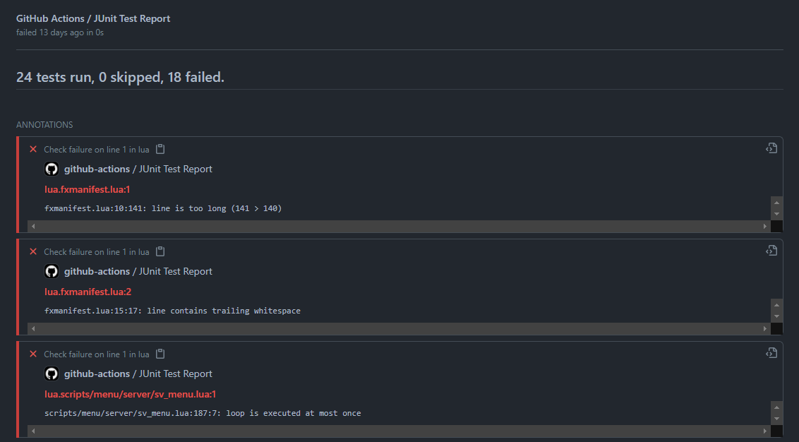

# fivem-lua-lint-action

This GitHub Action runs `luacheck` on your Lua codebase against known FiveM natives for any GitHub repository!

> Note: The FiveM Lua backtick syntax is **NOT** supported, please use `GetHashKey()` instead.

---

## Using

To use this in your GitHub repository, create the following file:

> **.github/workflows/lint.yml**

```yml
name: CI
on: [push, pull_request]
jobs:
  lint:
    name: Lint Lua Scripts
    runs-on: ubuntu-latest
    steps:
      - name: Checkout
        uses: actions/checkout@v2
      - name: Lint
        uses: GoatG33k/fivem-lua-lint-action@v1
```

This will automatically run `luacheck` for both commits and pull requests!

---

## JUnit Reporting (Getting Fancy)

If you would like to display fancy results in the GitHub action job, you can try the following configuration,
which outputs a JUnit results file:



> **.github/workflows/lint.yml**

```yml
name: CI
on: [push, pull_request]
jobs:
  lint:
    name: Lint Lua Scripts
    runs-on: ubuntu-latest
    steps:
      - name: Checkout
        uses: actions/checkout@v2
      - name: Lint
        uses: GoatG33k/fivem-lua-lint-action@dev
        with:
          capture: "junit.xml"
          args: "-t --formatter JUnit"
      - name: Publish Test Report
        uses: mikepenz/action-junit-report@v2
        with:
          report_paths: "**/junit.xml"
          fail_on_failure: 0
```
